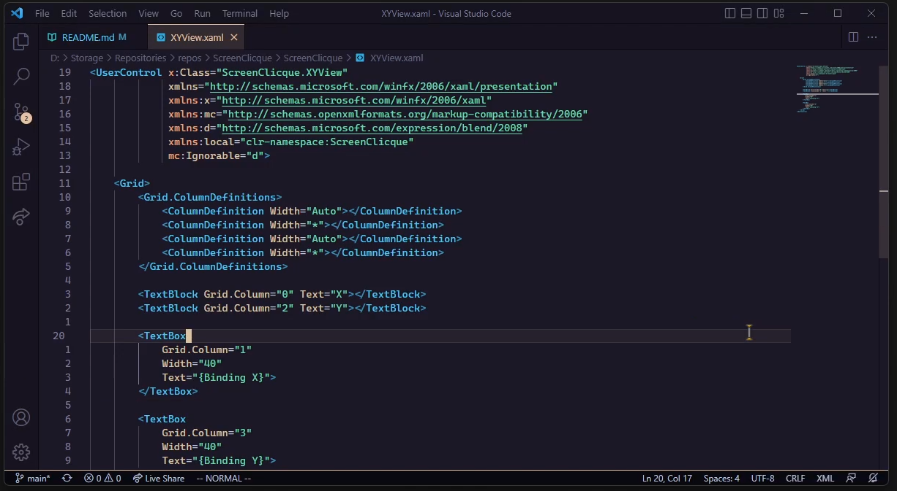
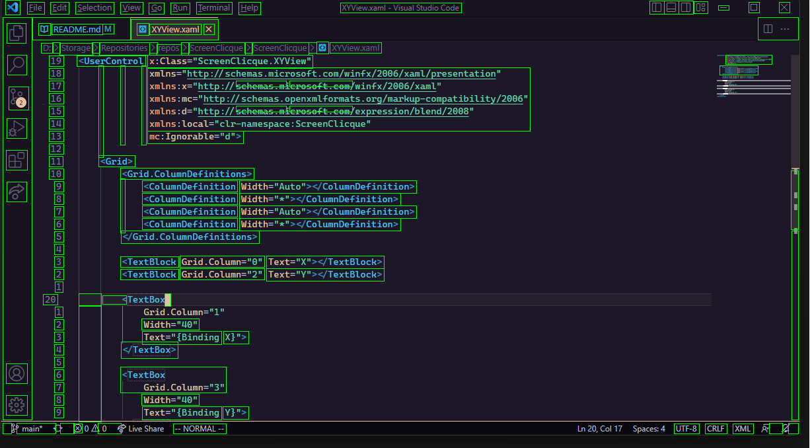
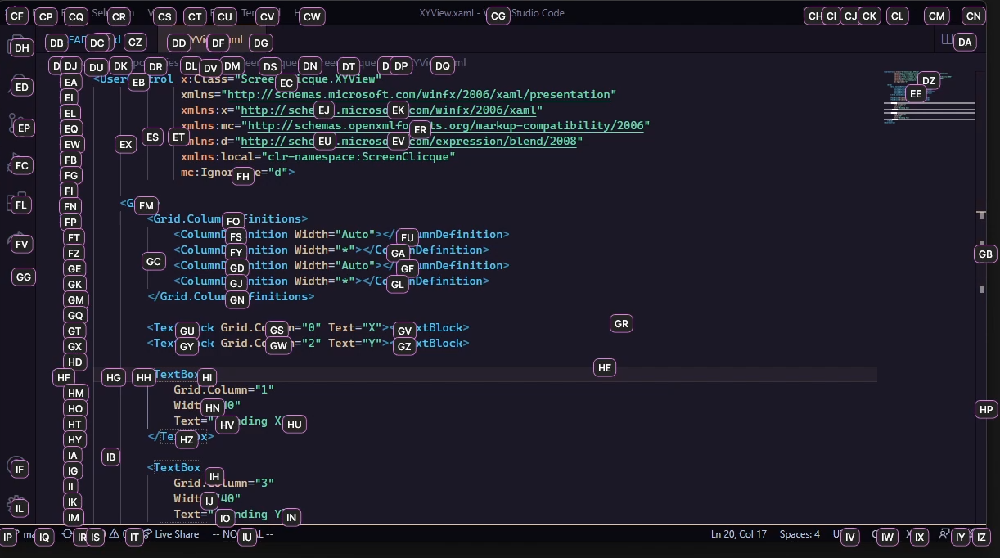
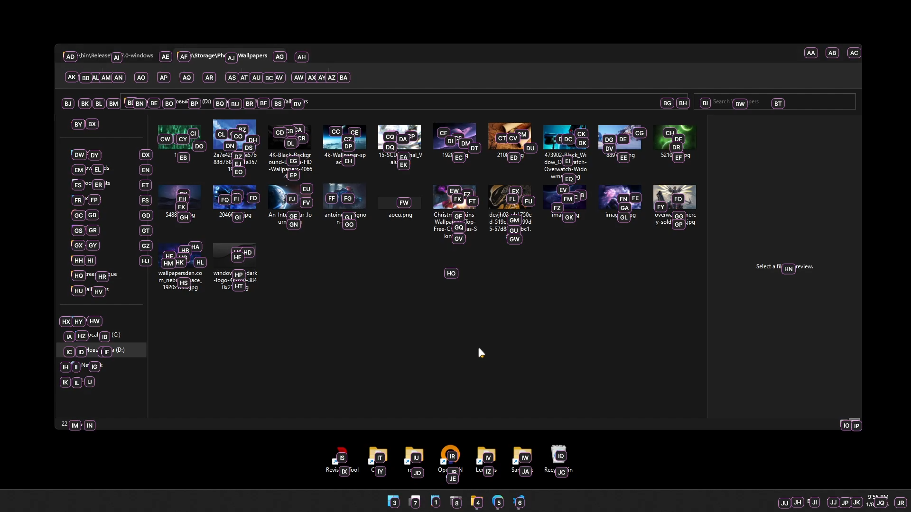

# ScreenClicque

That application allows perform mouse clicks without using mouse tho.

`Alt` + `Space` + 1-3 Alphabet Keys = **Mouse click** to necessary position.

System is powered by OpenCV (in .NET via Emgu.CV). There're no neural networks or superintellectual algorithms

Screen before | OpenCV detection
---- | ---- 
 | 

**Screen after**
--------

The click area coverages the full screen

